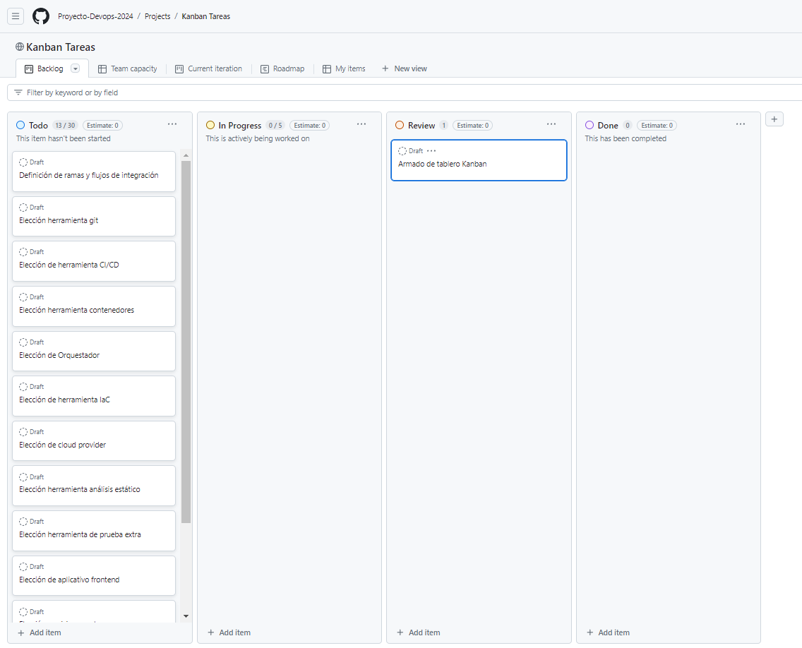
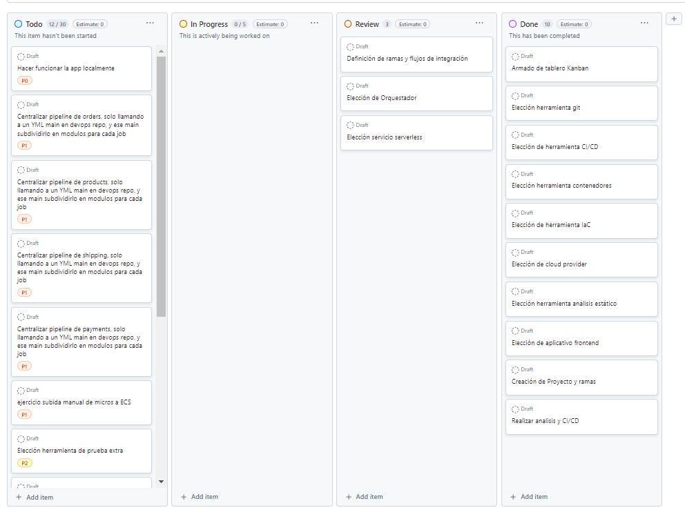
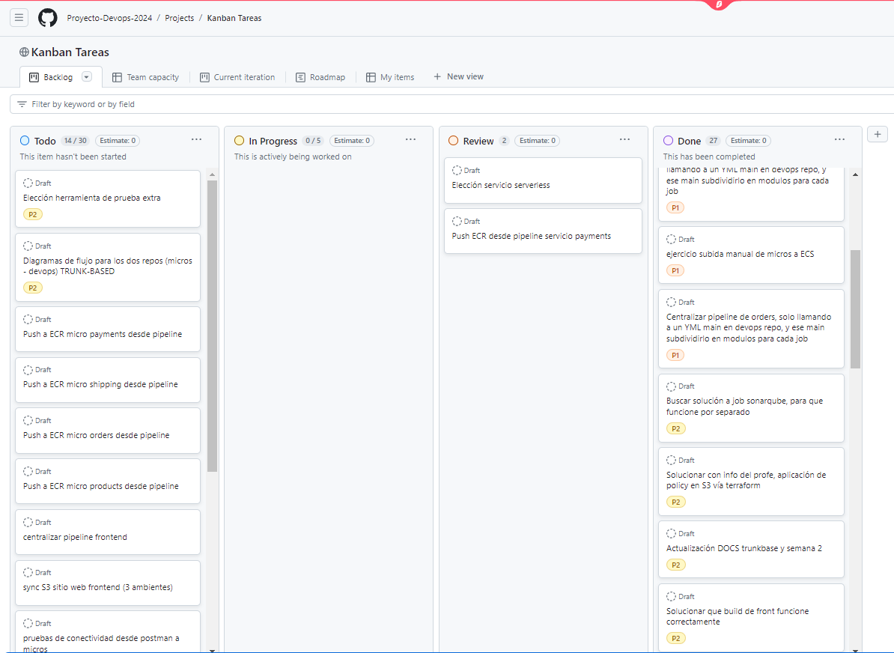
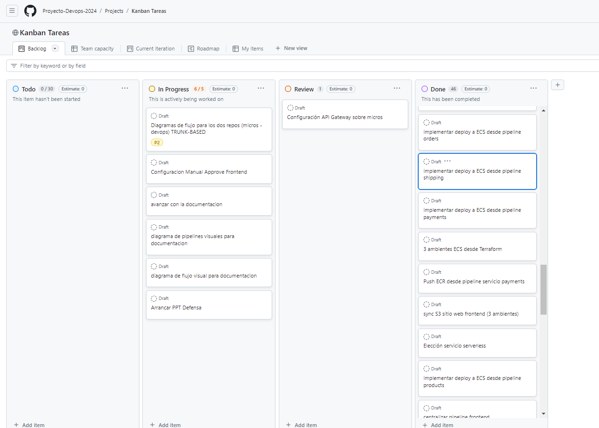

# UNIVERSIDAD ORT URUGUAY - Facultad de Ingeniería
## Proyecto Devops 2024 
Certificado Devops
Grupo5: Sebastián Berrospe (198596) - Lucas González (251012)

### Índice

1. [Introducción](#introducción) listo
1. [Solución Propuesta](#solución-propuesta) 
1. [Herramientas Utilizadas](#herramientas-utilizadas) listo
1. [Estrategia de Ramas](#estrategia-de-ramas) listo
1. [Procesos CI/CD](#procesos-ci-cd)
    - [Integración continua](#desarrollo)
    - [Entrega continua](#producción)
1. [Topología](#topologia)
1. [Testing](#testing)
    - [Análisis de código estático](#desarrollo)
    - [Herramienta externa](#producción)
1. [Seguimiento de trabajos y tareas](#seguimiento-de-trabajos-y-tareas) listo
1. [Repositorios](#repositorios)


# Introducción
Una empresa líder en el sector retail en permanente innovación y lanzamientos de nuevas aplicaciones y soluciones para sus clientes, detecta recurrentes inconvenientes en los procesos e integración del equipos, en las distintas etapas que hacen al ciclo de vida del desarrollo.

Existe una profunda falta de integración y comunicación entre los equipos de desarrollo e infraestructura, lo que genera en permanentes errores inesperados en el lanzamiento de nuevas versiones, complejos y extensos ciclos de desarrollo, demoras importantes en la detección y solución de errores para las distintas iteraciones, entre otros.

El equipo de proyecto es asignado entonces en buscar una solución a este problema, que por lo analizado escapa a algo técnico por falta de nivel o equipo calificado, sino que es generado por una falta de cultura colaborativa en la integración de los distintos equipos.

# Solución Propuesta

Para la solución a estos inconvenientes detectados, se plantea una solución basada en la cultura DevOps, dejando atrás la forma "old school" con la que se manejaba la empresa.

Esto traerá mejoras importantes como:
 
  - Menor time to market
  - Rápidos tiempos de respuesta ante incidentes
  - Iteraciones más cortas con feedback continuo 
  - Automatización de procesos varios
  - Integración continua y despliegue continuo 


# Herramientas Utilizadas

- <span style="color:blue">Herramienta Git:</span> Git/Github
- <span style="color:blue">Kanban:</span> Github Project
- <span style="color:blue">Herramienta CI/CD:</span> Github Actions
- <span style="color:blue">Herramienta para contenedores:</span> Docker
- <span style="color:blue">Orquestador:</span> ECS
- <span style="color:blue">Herramienta IaC:</span> Terraform
- <span style="color:blue">Cloud Provider:</span> AWS
- <span style="color:blue">Herramienta para análisis de código estático:</span> SonarQube
- <span style="color:blue">Herramienta para análisis de prueba extra:</span> JMeter
- <span style="color:blue">Elección de aplicativo de FE a buildear y desplegar:</span> Vue (S3)
- <span style="color:blue">Elección del servicio serverless a usar: API Gateway
- <span style="color:blue">Estrategia de Ramas:</span> (Gitflow o Trunk-Based)
    - <span style="color:blue">devops-repo:</span>  Trunk-Based
    - <span style="color:blue">frontend-vue:</span>  Trunk-Based
    - <span style="color:blue">payments-service:</span>  Trunk-Based
    - <span style="color:blue">products-service:</span>  Trunk-Based
    - <span style="color:blue">shipping-service:</span>  Trunk-Based
    - <span style="color:blue">orders-service:</span>  Trunk-Based

# Estrategia de Ramas
#### Ramas Microservicios:
<span style="color:blue">Estrategia Trunk-Based</span>  
Elegimos estra estrategia para el seguimiento del flujo, ya que tenemos una correcta segmentación de los cuatro microservicios a trabajar, teniendo 4 respositorios independientes.
Esto nos permite que cuando un solo microservicio tiene cambios en el código, solo se ejecutará el pipeline correspondiente a él, y no todos los microservicios.
Al ser de esta manera, y teniendo tres ambientes los cuales recorrerá el pipeline, deployando el mismo código en cada uno de ellos, nos parece una correcta forma de seguimiento, ya que en caso de eventuales inconvenientes, el problema podrá ser detectado por cada micro servicio en el pipeline, tanto en ambiente dev o test, antes de pasar a producción, previa autorización manual. 
#### Rama Devops:
<span style="color:blue">Estrategia Trunk-Based</span>
Para el caso de esta repositorio, también entendimos conveniente esta estrategía.
A diferencia de las ramas para microservicios, todas las modificaciones de código serán generadas por el equipo utilizando feature-branches, lo que nos permite no solo el versionado correspondiente a los códigos a crear, sino también un correcto seguimiento y monitoreo por parte del equipo, generando pull request para la autorización de cada nuevo feature a agregar.

# SECRETS ORGANIZACIÓN

S3_BUCKET_DEV - dev-devapp-devops-bucket
S3_BUCKET_TEST - test-testapp-devops-bucket
S3_BUCKET_PROD - prod-prodapp-devops-bucket

# TRUNK-BASED
Trabajando con feature branches y pull requests en trunk-based development:

##### Clonar repositorio

Posisionado donde querramos clonar nuestro repositorio en nuestro equipo, abrimos la terminal de bash y escribimos:

git clone https://github.com/Proyecto-Devops-2024/devops-repo

##### Crear la feature branch:

Desde la rama principal (trunk), crea una nueva rama para la característica:


```markdown
git checkout main
git pull origin main
git checkout -b feature/nueva-funcionalidad
```
##### Desarrollar en la feature branch:
Realiza los cambios necesarios en el código. Asegúrate de realizar commits pequeños y frecuentes:

```markdown
git add .
git commit -m "Implementa parte de la nueva funcionalidad"
```
##### Mantener la feature branch actualizada:
Dado que otros desarrolladores estarán fusionando sus cambios en el trunk, es importante mantener tu feature branch actualizada:

```markdown
git checkout main
git pull origin main
git checkout feature/nueva-funcionalidad
git merge main
```

##### Subir la feature branch al repositorio remoto:
Una vez que tu funcionalidad está lista para revisión, sube tu rama al repositorio remoto:

```markdown
git push origin feature/nueva-funcionalidad
```

##### Crear un pull request:
En la plataforma de alojamiento de tu repositorio (como GitHub, GitLab, Bitbucket, etc.), navega a la sección de pull requests y crea un nuevo pull request. Selecciona la rama feature/nueva-funcionalidad como la rama fuente y main como la rama destino. Asegúrate de incluir una descripción clara de los cambios y el propósito del PR.

##### Revisión del pull request:
Otros desarrolladores revisarán tu pull request. Pueden solicitar cambios, hacer comentarios, o aprobarlo. Si se solicitan cambios, realiza los ajustes necesarios en tu feature branch y súbelos:

```markdown
git add .
git commit -m "Realiza cambios según comentarios del PR"
git push origin feature/nueva-funcionalidad
```

##### Fusionar el pull request:
Una vez que el pull request ha sido aprobado, puede ser fusionado en la rama main. Esto generalmente se hace desde la interfaz de la plataforma de repositorio.

##### Eliminar la feature branch:
Después de que la rama ha sido fusionada y el código ha sido desplegado, puedes eliminar la feature branch tanto local como remotamente:

```markdown
git branch -d feature/nueva-funcionalidad
git push origin --delete feature/nueva-funcionalidad
```

# Backend

Prerrequisitos
```markdown
Instalar JDK
```
Empaquetado
```markdown
./mvnw clean package
```

Dockerfile
```markdown
FROM openjdk:8-jdk-alpine
ARG JAR_FILE
COPY ${JAR_FILE} app.jar
CMD java -jar /app.jar $APP_ARGS
```

Crear imagen
```markdown
docker build --build-arg JAR_FILE=target/payments-service-example-0.0.1-SNAPSHOT.jar -t payments-service-example:1 .
```

Crear contenedor y ejecutarlo
```markdown
docker run -d -p 8080:8080 --name payments-service-example payments-service-example:1
```

Crear contenedor y ejecutarlo conectando con el resto de servicios
```markdown
docker run -d --name orders-service-example --env "APP_ARGS=http://172.17.0.2:8080 http://172.17.0.3:8081 http://172.17.0.4:8082" orders-service-example:1
```

Obtener ip del contenedor(Inspect)
```markdown
docker inspect payments-service-example
```


# Seguimiento de trabajos y tareas
### Inicio Semana 1


### Inicio Semana 2


### Inicio Semana 3


### Inicio Semana 4
