# UNIVERSIDAD ORT URUGUAY - Facultad de Ingeniería
## Proyecto Devops 2024 
Certificado Devops
Grupo5: Sebastián Berrospe (198596) - Lucas González (251012)

### Índice

1. [Introducción](#introducción) listo
1. [Solución Propuesta](#solución-propuesta) 
1. [Herramientas Utilizadas](#herramientas-utilizadas) listo
1. [Estrategia de Ramas](#estrategia-de-ramas) listo
1. [Procesos CI-CD](#procesos-ci-cd) listo
    - [Integración continua](#integración-continua) listo
    - [Entrega continua](#entrega-continua) listo
1. [Topología e Infraestructura](#topologia-e-infraestructura)
1. [Testing](#testing)
    - [Análisis de código estático](#desarrollo)
    - [Herramienta externa](#producción)
1. [Seguimiento de trabajos y tareas](#seguimiento-de-trabajos-y-tareas) listo
1. [Repositorios](#repositorios)


# Introducción
Una empresa líder en el sector retail en permanente innovación y lanzamientos de nuevas aplicaciones y soluciones para sus clientes, detecta recurrentes inconvenientes en los procesos e integración del equipos, en las distintas etapas que hacen al ciclo de vida del desarrollo.

Existe una profunda falta de integración y comunicación entre los equipos de desarrollo e infraestructura, lo que genera en permanentes errores inesperados en el lanzamiento de nuevas versiones, complejos y extensos ciclos de desarrollo, demoras importantes en la detección y solución de errores para las distintas iteraciones, entre otros.

El equipo de proyecto es asignado entonces en buscar una solución a este problema, que por lo analizado escapa a algo técnico por falta de nivel o equipo calificado, sino que es generado por una falta de cultura colaborativa en la integración de los distintos equipos.

# Solución Propuesta

Para la solución a estos inconvenientes detectados, se plantea una solución basada en la cultura DevOps, dejando atrás la forma "old school" con la que se manejaba la empresa.

Esto traerá mejoras importantes como:
 
  - Menor time to market
  - Rápidos tiempos de respuesta ante incidentes
  - Iteraciones más cortas con feedback continuo 
  - Automatización de procesos varios
  - Integración continua y despliegue continuo 

Los microservicios serán implementados en AWS, con el orquestador ECS, y mediante pipelines de Github Actions, se implementarán todo el proceso CI/CD en cada push o pull request al repositorio correspondiente.

# Herramientas Utilizadas

- <span style="color:blue">Herramienta Git:</span> Git/Github
- <span style="color:blue">Kanban:</span> Github Project
- <span style="color:blue">Herramienta CI/CD:</span> Github Actions
- <span style="color:blue">Herramienta para contenedores:</span> Docker
- <span style="color:blue">Orquestador:</span> ECS
- <span style="color:blue">Herramienta IaC:</span> Terraform
- <span style="color:blue">Cloud Provider:</span> AWS
- <span style="color:blue">Herramienta para análisis de código estático:</span> SonarQube
- <span style="color:blue">Herramienta para análisis de prueba extra:</span> JMeter
- <span style="color:blue">Elección de aplicativo de FE a buildear y desplegar:</span> Vue (S3)
- <span style="color:blue">Elección del servicio serverless a usar: API Gateway
- <span style="color:blue">Estrategia de Ramas:</span> (Gitflow o Trunk-Based)
    - <span style="color:blue">devops-repo:</span>  Trunk-Based
    - <span style="color:blue">frontend-vue:</span>  Trunk-Based
    - <span style="color:blue">payments-service:</span>  Trunk-Based
    - <span style="color:blue">products-service:</span>  Trunk-Based
    - <span style="color:blue">shipping-service:</span>  Trunk-Based
    - <span style="color:blue">orders-service:</span>  Trunk-Based

# Secrets a nivel de organización

- AWS_ACCESS_KEY_ID - para implementaciones en AWS.
- AWS_SECRET_ACCESS_KEY - para implementaciones en AWS.
- AWS_SESSION_TOKEN - para implementaciones en AWS.
- AWS_ACCOUNT_ID - para push en ECRs de AWS.
- SONAR_ORGANIZATION - para vinculación con sonarQube.
- SONAR_TOKEN - para vinculación con sonarQube.

# Estrategia de Ramas
#### Ramas Microservicios:
<span style="color:blue">Estrategia Trunk-Based</span>  
Elegimos estra estrategia para el seguimiento del flujo, ya que tenemos una correcta segmentación de los cuatro microservicios a trabajar, teniendo 4 respositorios independientes.
Esto nos permite que cuando un solo microservicio tiene cambios en el código, solo se ejecutará el pipeline correspondiente a él, y no todos los microservicios.
Al ser de esta manera, y teniendo tres ambientes los cuales recorrerá el pipeline, deployando el mismo código en cada uno de ellos, nos parece una correcta forma de seguimiento, ya que en caso de eventuales inconvenientes, el problema podrá ser detectado por cada micro servicio en el pipeline, tanto en ambiente dev o test, antes de pasar a producción, previa autorización manual. 
#### Rama Devops:
<span style="color:blue">Estrategia Trunk-Based</span>
Para el caso de esta repositorio, también entendimos conveniente esta estrategía.
A diferencia de las ramas para microservicios, todas las modificaciones de código serán generadas por el equipo utilizando feature-branches, lo que nos permite no solo el versionado correspondiente a los códigos a crear, sino también un correcto seguimiento y monitoreo por parte del equipo, generando pull request para la autorización de cada nuevo feature a agregar.


#### Trunkbase con feature branch

Toda la implementación se fue generando, creando distintas ramas feature/xxxx-xxxx

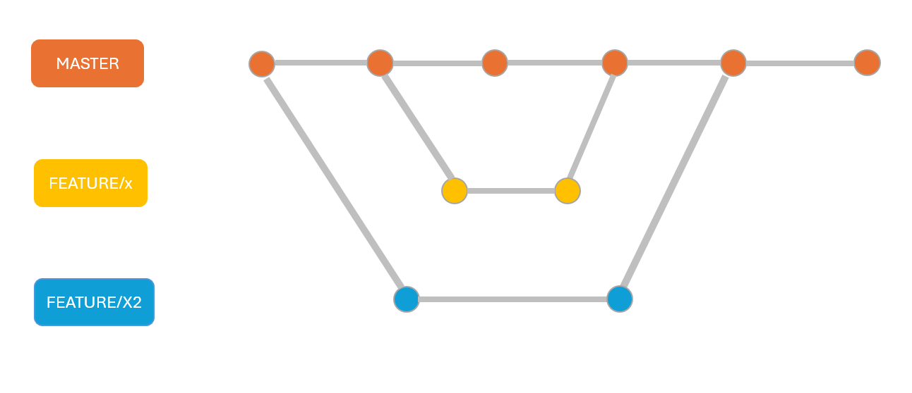

Desde la rama principal (trunk), crea una nueva rama para la característica:


```markdown
git checkout main
git pull origin main
git checkout -b feature/nueva-funcionalidad
```
##### Desarrollar en la feature branch:
Realiza los cambios necesarios en el código. Asegúrate de realizar commits pequeños y frecuentes:

```markdown
git add .
git commit -m "Implementa parte de la nueva funcionalidad"
git pull
```
##### Pull Request
Finalmente para correcto seguimiento del código por parte del equipo, los cambios se implementan en la rama main, previa aprobación para este merge.

##### Eliminar la feature branch:
Después de que la rama ha sido fusionada y el código ha sido desplegado, se elimina la feature branch tanto local como remotamente:

```markdown
git branch -d feature/nueva-funcionalidad
git push origin --delete feature/nueva-funcionalidad
```

#### Microservicios

Previa a la implementación y creación de los distintos pipelines encargados del CI/CD, se pusieron en funcionamiento los distintos microservicios en forma local en los equipos de grupo. Algunos comandos utilizados como los siguientes, luego pasarán a ser la base del CI dentro de los pipelines a implementar en Github Actions.

Esta implementación local se crea utilizando contenedores en docker.

Build de la app
```markdown
./mvnw clean package
```
Test de la app
```markdown
./mvnw test
```
Dockerfile
```markdown
FROM openjdk:8-jdk-alpine
ARG JAR_FILE
COPY ${JAR_FILE} app.jar
CMD java -jar /app.jar $APP_ARGS
```

Crear imagen
```markdown
docker build --build-arg JAR_FILE=target/payments-service-example-0.0.1-SNAPSHOT.jar -t payments-service-example:1 .
```

Crear contenedor y ejecutarlo
```markdown
docker run -d -p 8080:8080 --name payments-service-example payments-service-example:1
```

Crear contenedor y ejecutarlo conectando con el resto de servicios
```markdown
docker run -d --name orders-service-example --env "APP_ARGS=http://172.17.0.2:8080 http://172.17.0.3:8081 http://172.17.0.4:8082" orders-service-example:1
```

# Procesos CI-CD

Para una correcta administración de los códigos generados, para los distintos pipelines de la implementación, se optó por una implementación centralizada, teniendo toda la configuración dentro del repositorio devops.

```markdown
name: products-pipeline

on:
  push:
    branches:
      - main

  pull_request:
    branches:
      - main

  workflow_dispatch:

permissions: write-all

jobs:
  main-workflow:
    uses: Proyecto-Devops-2024/devops-repo/.github/workflows/main-workflow.yml@main
    with:
      sonar_project_key: Proyecto-Devops-2024_products-service
      service_name: products
    secrets: inherit

```

Esto es de utilidad ya que es una solución más acorde al mundo real, ya que dentro de los repositorios donde tienen acceso los distintos desarrolladores de la aplicación, simplemente se hace un llamado a que inicie el proceso del pipeline, impidiendo de esta manera que un tercero fuera del equipo Devops pueda modificarlos.

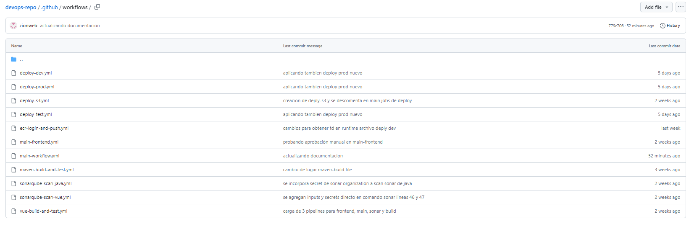

Se crean dos archivos troncales de todo el pipeline, uno para los distintos servicios de backend, y otro para todo el proceso ci/cd del frontend.

Microservicios (main-workflow.yml)
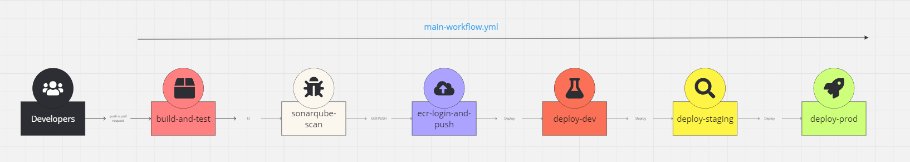

Frontend (main-frontend.yml)
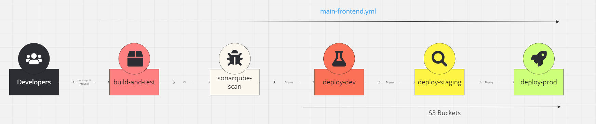

Estos dos archivos principales, van llamando a distintos sub tareas, que se encuentran bajo la misma carpeta en distintos archivos, favoreciendo de esta manera la reutilización de los códigos.

Se utilizaron distintas variables para reutilizar los distintos archivos sobre distintos ambientes, microservicios, etc.

```markdown
name: main-workflow

on:
  workflow_call:
    inputs:
      sonar_project_key:
        required: true
        type: string
      service_name:
        required: true
        type: string
    secrets:
      AWS_ACCESS_KEY_ID:
        required: true
      AWS_SECRET_ACCESS_KEY:
        required: true
      AWS_SESSION_TOKEN:
        required: true
      AWS_ACCOUNT_ID:
        required: true
permissions: write-all
jobs:
  
  build-and-test:
    uses: ./.github/workflows/maven-build-and-test.yml
  
  
  sonarqube-scan:
    needs: build-and-test
    uses: ./.github/workflows/sonarqube-scan-java.yml
    with:
      sonar_project_key: ${{ inputs.sonar_project_key }}
    secrets: inherit  

  ecr-login-and-push:
    needs: sonarqube-scan
    uses: ./.github/workflows/ecr-login-and-push.yml
    with:
      service_name: ${{ inputs.service_name }}
    secrets: inherit

  deploy-dev:
    needs: ecr-login-and-push
    uses: ./.github/workflows/deploy-dev.yml
    with:
      service_name: ${{ inputs.service_name }}
      environment: "dev"
    secrets: inherit

  deploy-staging:
    needs: deploy-dev
    uses: ./.github/workflows/deploy-test.yml
    with:
      service_name: ${{ inputs.service_name }}
      environment: "test"
    secrets: inherit

  deploy-prod:
    needs: deploy-staging
    uses: ./.github/workflows/deploy-prod.yml
    with:
      service_name: ${{ inputs.service_name }}
      environment: "prod"
    secrets: inherit

```

## Integración continua

Para los procesos de CI en la estructura backend JAVA, se utilizaron los siguientes archivos:
- maven-build-and-test.yml
  Encargado de el build inicial y mvn test
- sonarqube-scan-java.yml
  Encargado de hacer la conexión con sonar y realizar los test automatizados.

Para el caso de los procesos de CI en la estructura frontend VUE, se utilizaron los siguientes archivos:
- vue-build-and-test.yml
  Encargado del build inicial y testing inicial en VUE
- sonarqube-scan-vue.yml
  Encargado de hacer la conexión con sonar y realizar los test automatizados.

## Entrega continua

En el caso de la entrega continua del backend, se utilizaron los siguientes archivos:
- ecr-login-and-push.yml
  Encargado del login en AWS y el push a los 4 ECRs creados via iac.
- deploy-dev.yml
  Encargado de realizar el deploy sobre el ECS dev
- deploy-test.yml
  Encargado de realizar el deploy sobre el ECS test
- deploy-prod.yml
  Encargado de realizar el deploy sobre el ECS prod

Para el caso de la entrega continua del frontend. se utilizaron los siguientes archivos:
- deploy-s3.yml
  Este archivo recibiendo un ambiente y una dirección de un recurso S3 bucket en amazon, se encarga de subir los códigos resultantes luego del build and test

```markdown
deploy-dev:
    needs: sonarqube-scan
    uses: ./.github/workflows/deploy-s3.yml
    with:
      environment: dev
      s3_bucket: "dev-devapp-devops-bucket"
    secrets: inherit

  deploy-test:
    needs: deploy-dev
    uses: ./.github/workflows/deploy-s3.yml
    with:
      environment: test
      s3_bucket: "test-testapp-devops-bucket"
    secrets: inherit

  deploy-prod:
    needs: deploy-test
    uses: ./.github/workflows/deploy-s3.yml
    with:
      environment: prod
      s3_bucket: "prod-prodapp-devops-bucket"
    secrets: inherit
```
## Demo 
Al momento de ejecutar un push sobre el respositorio products (o cualquiera de los cuatro), se ejecuta nuestro pipeline.

Una vez culminado el CI, se procede al deploy en AWS.

DEV
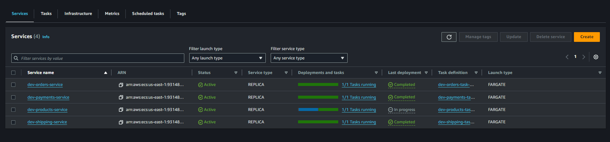

Se crea la nueva tarea, con la nueva task definition:
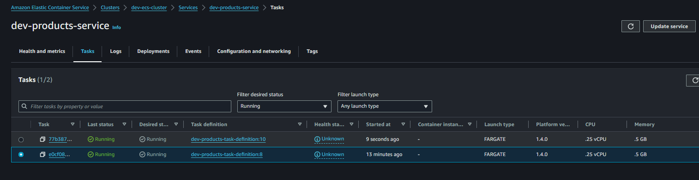

Por último la anterior tarea es dada de baja, quedando estable la nueva tarea operativa.
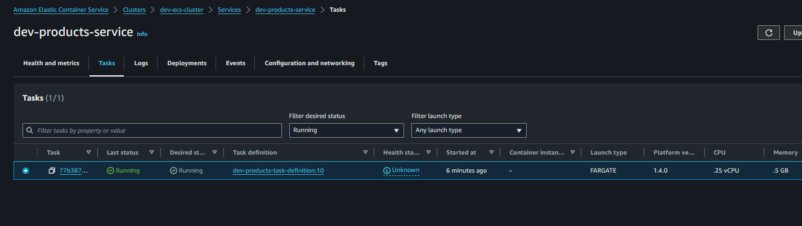

TEST
Lo mismo ocurre en ambiente de test
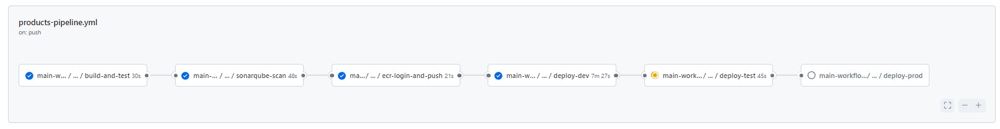

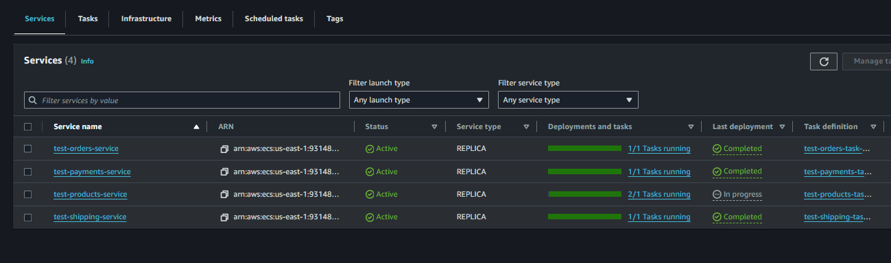

PROD
Lo mismo ocurre en ambiente de prod
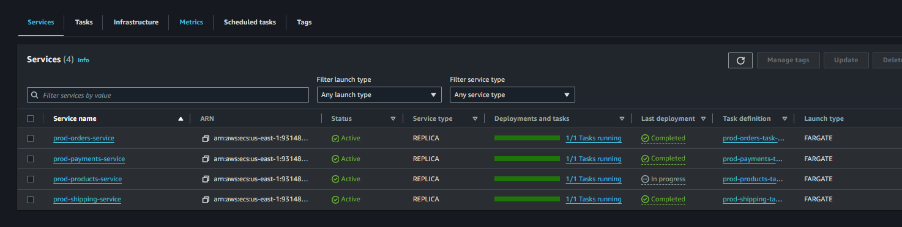

FINALIZACIÓN

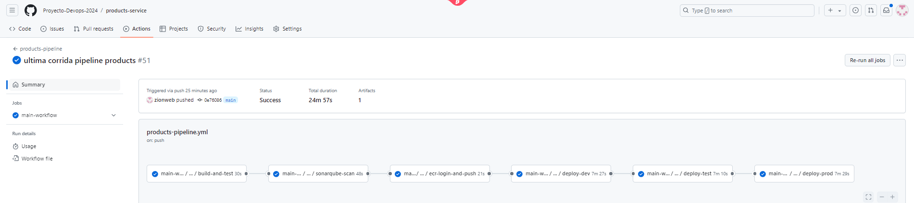

# Topología e Infraestructura

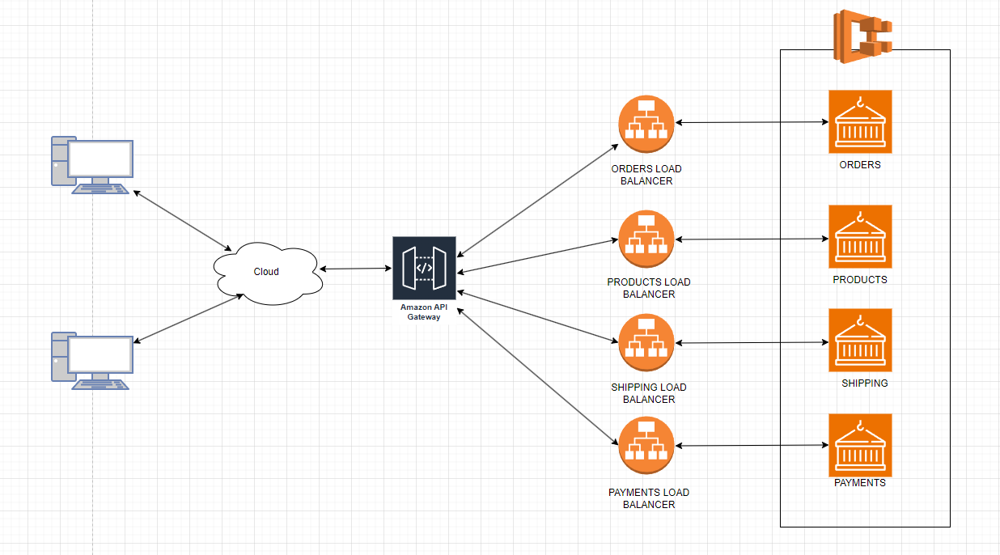

Utilizando la herramienta de iac Terraform, se generaron tres ambientes ECS, con sus correspondientes security groups, vpc, subnets, igw, etc.


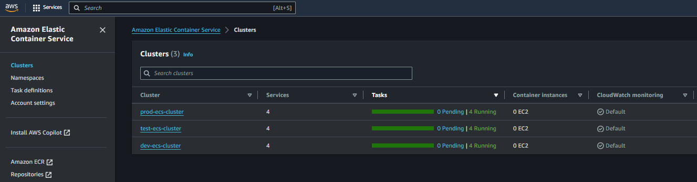

En cada ambiente se despliegan los cuatro contenedores, los cuales son vinculados cada uno con un load balancer.

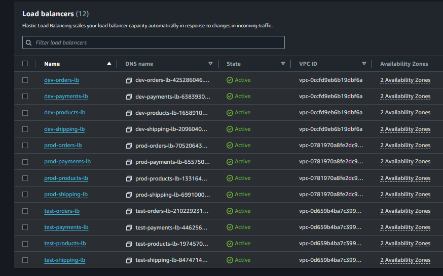

Finalmente para el acceso centralizado de los recursos, se implementó el servicio serverless de Api Gateway, unificando la URL en una sola.

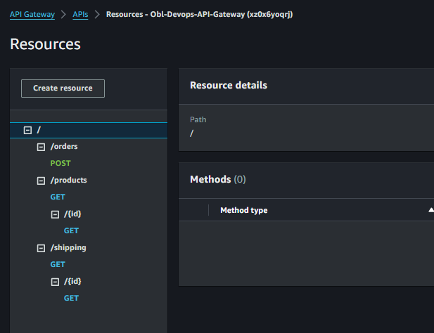

# Testing
En esta etapa se realizaron dos tipos de pruebas. Por un lado, se llevó a cabo un análisis de código estático utilizando la herramienta SonarCloud. Por otro lado, se realizaron pruebas de carga y escalabilidad con la herramienta JMeter, enfocándose exclusivamente en los cuatro microservicios. Además, al análisis de código estático se le agregó la evaluación del front-end.

## Análisis de código estático
SonarCloud proporciona informacion valiosa para detectar problemas en el codigo sin necesidad de ejecucion, en los siguientes titulos se pasara a mostrar cada Back-end/Front-end con su respectivo analisis estatico dando un resumen del analisis y una vista detallada de los problemas, en la misma se puede visualizar cada uno de ellos con su criticida, calidad de codigo, codigo limpio, tipos, etc.

### Front-End

#### Vue
El resumen del analisis estatico para Vue, no se marca problemas en la seguridad ni fiabilidad, solo muestra 2 problemas en la mantenibilidad, con un 100% en Puntos críticos revisados, un 0% de cobertura con pruebas automatizadas y 0% de codigo duplicado.

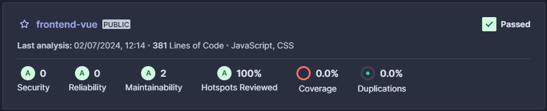

##### Detalle
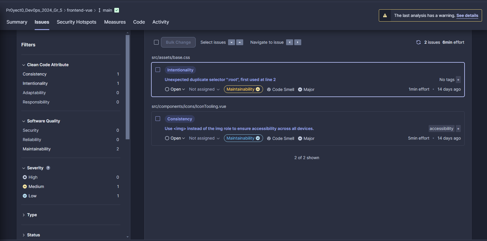

### Back-End

#### Orders Service
El resumen del analisis estatico para Orders Service, se marca 1 problema en la seguridad, 3 en la fiabilidad, 10 en la mantenibilidad, con un 100% en Puntos críticos revisados, un 0% de cobertura con pruebas automatizadas y 15.7% de codigo duplicado.

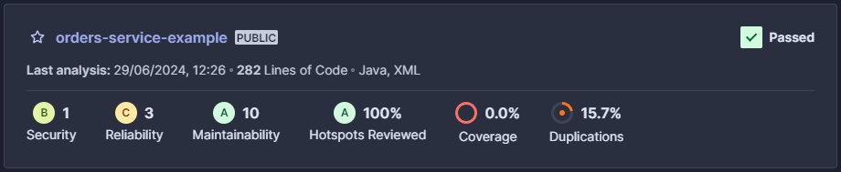

##### Detalle
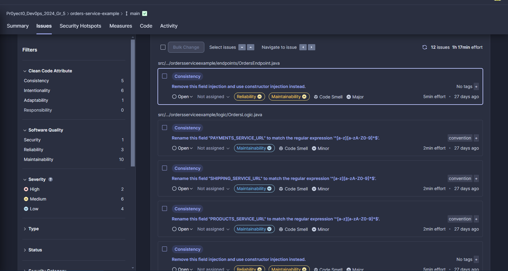

#### Payments Service
El resumen del analisis estatico para Payments Service, no se marcan problemas en la seguridad, 2 problemas en fiabilidad, solo muestra 4 problemas en la mantenibilidad, con un 0% en Puntos críticos revisados, un 0% de cobertura con pruebas automatizadas y 0% de codigo duplicado.

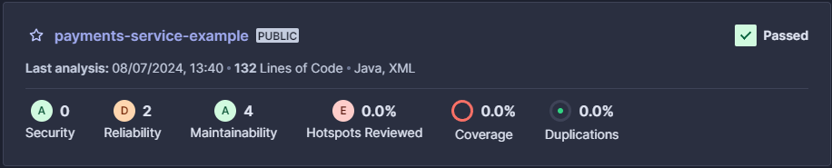

##### Detalle
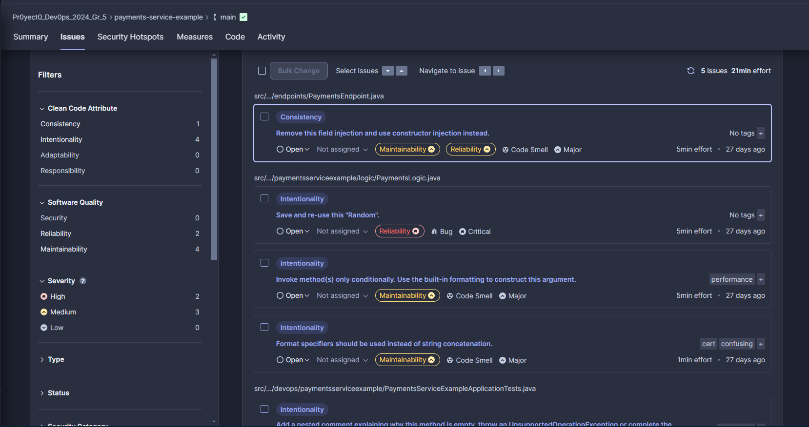

#### Products Service
El resumen del analisis estatico para Products Service, no se marca problemas en la seguridad, 1 problema en fiabilidad, 6 en la mantenibilidad, con un 100% en Puntos críticos revisados, un 0% de cobertura con pruebas automatizadas y 0% de codigo duplicado.

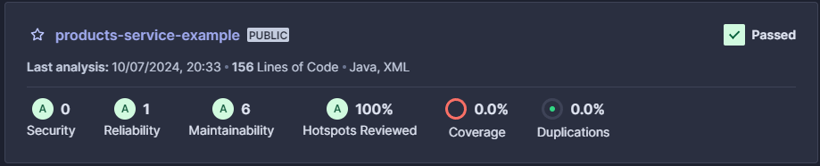

##### Detalle
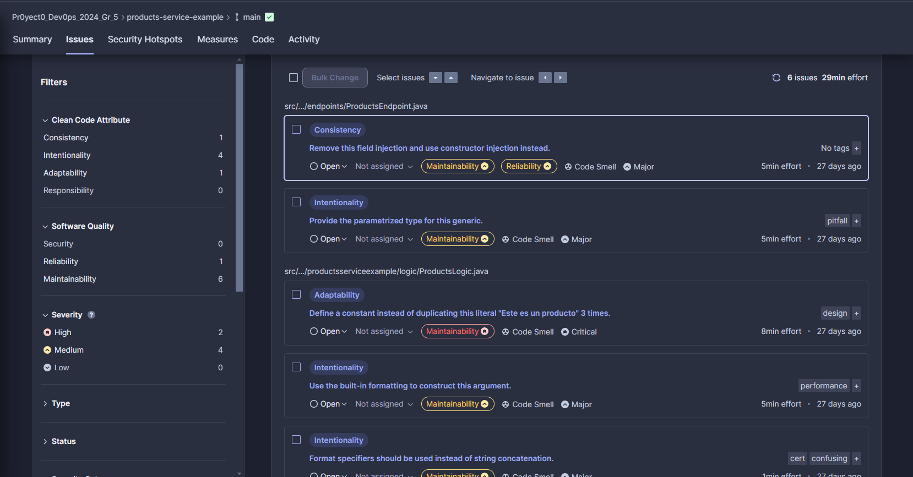

#### Shipping Service
El resumen del analisis estatico para Shipping Service, donde no se marca problemas en la seguridad, 1 solo problema en fiabilidad, 8 en la mantenibilidad, con un 100% en Puntos críticos revisados, un 0% de cobertura con pruebas automatizadas y 0% de codigo duplicado.


##### Detalle
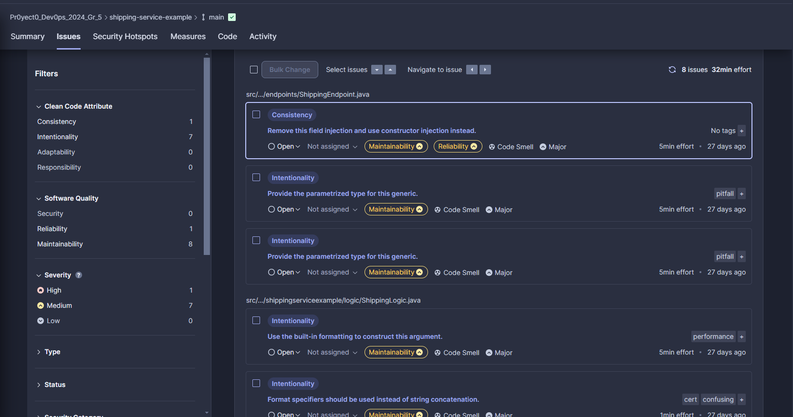

### Resumen
A partir de cada análisis, tanto del Front-end como del Back-end, se puede obtener una visión general del estado del código a través de los resúmenes de análisis estático. Si es necesario, se puede revisar el detalle de los problemas identificados, donde SonarCloud proporciona explicaciones claras de cada error y las razones por las cuales deben ser corregidos. De esta manera, cada punto puede ser investigado a fondo utilizando la información proporcionada, permitiendo así corregir todos los problemas y mejorar la calidad del código.

## Herramienta externa
En esta prueba de escalabilidad, los cuatro servicios de backend se despliegan en la nube. A cada uno se le asigna un autoscalador con parámetros especificados para cada prueba. De este modo, cuando los servicios reciben una cantidad muy grande de datos a  traves de sus end points, se generan nuevas instancias del servicio para cubrir la demanda. A esta forma de escalamiento se le denomina "escalado horizontal".

La herramienta JMeter permite realizar múltiples peticiones en paralelo a cualquier endpoint dado, lo que la hace ideal para pruebas de rendimiento y carga. Con JMeter, puedes simular una alta carga de usuarios concurrentes para evaluar cómo se comporta tu aplicación bajo diferentes condiciones de estrés. Además, JMeter proporciona métricas detalladas sobre el tiempo de respuesta, la tasa de errores y el rendimiento general del sistema, ayudando a identificar cuellos de botella y mejorar la eficiencia del servicio.

### Testings
A continuación, se adjuntan cada uno de los PDF de las pruebas:

* [Orders Service](./Testing%20Escalabilidad/Servicio%20Orders%20testing%20de%20escalabilidad.pdf)
* [Payments Service](./Testing%20Escalabilidad/Servicio%20Payment%20testing%20de%20escalabilidad.pdf)
* [Products Service](./Testing%20Escalabilidad/Servicio%20Products%20testing%20de%20escalabilidad.pdf)
* [Shipping Service](./Testing%20Escalabilidad/Servicio%20Shipping%20testing%20de%20escalabilidad.pdf)

También se adjunta un [video](./Testing%20Escalabilidad/Video%20Testing%20Escalabilidad%20Service%20Product.mp4), en el cual se muestra el proceso de la prueba de Products Service.

# Seguimiento de trabajos y tareas
Durante todo el proceso se fueron creando y asignando las distintas tareas correspondientes al proyecto, utilizando un tablero Kanban en la misma organización creada en GitHub.

### Inicio Semana 1


### Inicio Semana 2


### Inicio Semana 3


### Inicio Semana 4


# Repositorios

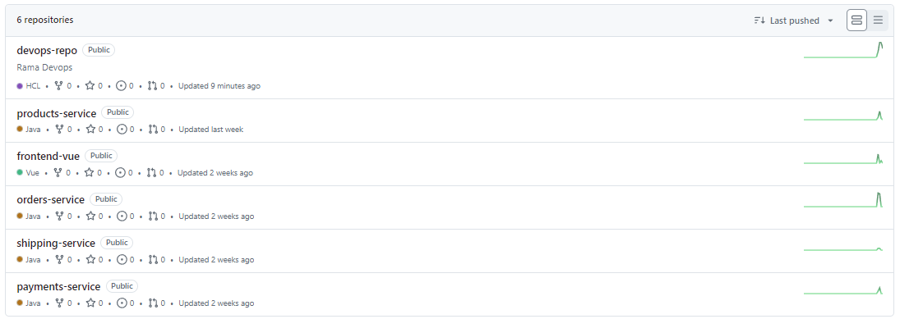
